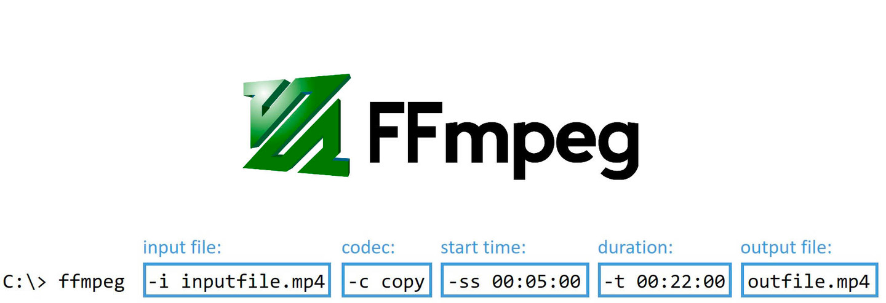

## 主要视频处理

图片视频压缩
https://blog.csdn.net/weixin_44468853/article/details/119961759

下载视频压缩工具，拷贝到项目工程要目录下
https://evermeet.cx/ffmpeg/

多个视频先去掉声音合并后，再添加文字与音频
https://blog.csdn.net/u012700515/article/details/80053785/

给视频增加音频和歌词
ffmpeg -i camera_video.mp4 -i mind_note.mp3 -vf subtitles=ge_ci.lrc -y audio_lrc.mp4

增加封面
cmd = "ffmpeg -i {} -i {} -map 1 -map 0 -c copy -disposition:0 attached_pic -y {}".format(self.fileInputPath, cover_path, self.fileOutPath)

1.获取视频流信息
用ffprobe可以获取到视频的所有流的具体信息

ffprobe -print_format json -show_streams -i input.mp4

2.多个视频拼接
可以将几个视频拼接成一个视频 -f 表示采用concat协议，-c 表示采用什么编码器 copy表示不重新编码，如果是x264 表示将采用x264进行重新编码。

ffmpeg -y -f concat -i videolist.txt -c copy  output.mp4

3.视频截图
截一张图
-ss 表示在视频的多少S 截取一张图

ffmpeg -y -ss 8 -i input.mp4 -f image2 -vframes 1 output.jpg

截多张图
-r 表示每秒截多少张图； -qscale 表示生成的截图质量，该值越小图片质量越好；%5d.jpg 表示生成的截图的命令规则，5位数的整数命名。

ffmpeg -y -ss 0 -i input.mp4 -f image2  -r 1 -t 8 -qscale 1 ./jpgs/%5d.jpg

4.给视频加上水印图片
ffmpeg -y -i input.mp4  -i ./logo.png filter_complex "overlay=0:0:enable=between(t,0,2)" -c:v libx264 -c:a aac -strict -2 output.mp4

5.图片合成视频
ffmpeg -y -f image2 -framerate 10 -i ./jpgs/%05d.jpg -c:v libx264 -r 25 -pix_fmt yuv420p output.mp4

6.视频添加背景音乐

ffmpeg -y -i input.mp4 -i ainiyiwannian.wav -filter_complex "[0:a] pan=stereo|c0=1*c0|c1=1*c1 [a1], [1:a] pan=stereo|c0=1*c0|c1=1*c1 [a2],[a1][a2]amix=duration=first,pan=stereo|c0<c0+c1|c1<c2+c3,pan=mono|c0=c0+c1[a]" -map "[a]" -map 0:v -c:v libx264 -c:a aac -strict -2 -ac 2 output.mp4

7.将视频去除音频
ffmpeg -y -i source.mp4 -an -vcodec copy output.mp4

9.视频转码
-vcodec 指定视频编码器，-acodec 指定音频编码器

ffmpeg -y -i input.mp4 -vcodec libx264 -acodec copy output.mp4

1.从视频中提取音频

ffmpeg -y -i source.mp4 -vn output.wav

2.将音频用lpcm格式重新编码，指定采样率

ffmpeg -y -i source.wav -acodec pcm_s16le -ar 44100 output.wav